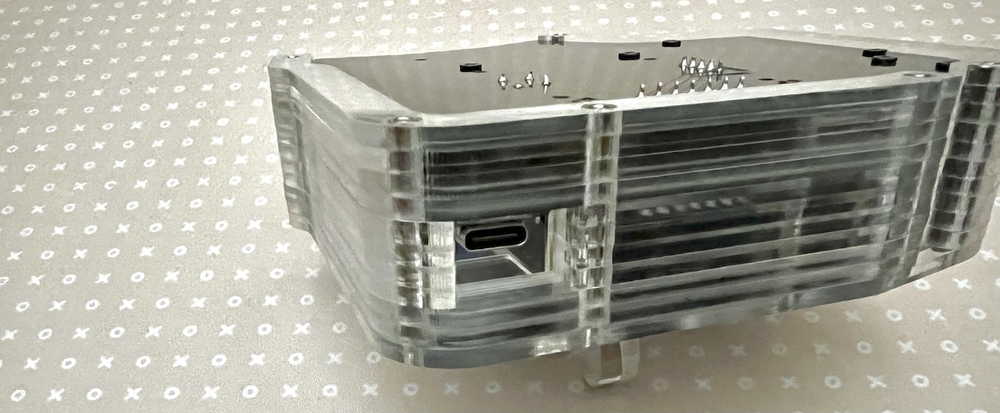

# Kombucha ジョイスティック アクリル積層ケース

## キット内容
|部品|数||
|-|-|-|
|トッププレート|1||
|ミドルプレート|10||
|ボトムプレート|1||
|スペーサー|6|27mm|

## 組み立て
組み立てられた状態で届くのでネジを外して一度分解してください。

Kombuchaのアクリルプレートを外します。

保護フィルムを外したトッププレートを載せてねじ止めします。空いたネジ穴にスペーサーを取り付けます。

USB部分が開くように重ねます（隙間のあるミドルプレートの枚数が５枚のものと6枚のものがあります）。

ボトムプレートを取り付けます。

ゴム足を貼ったら完成です。

