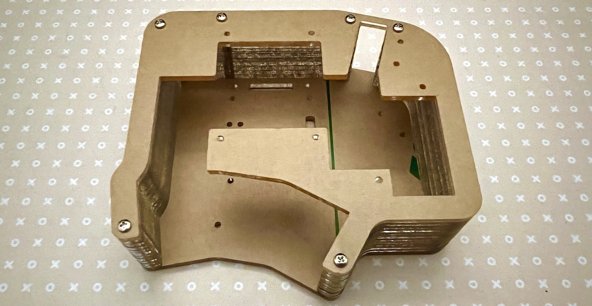
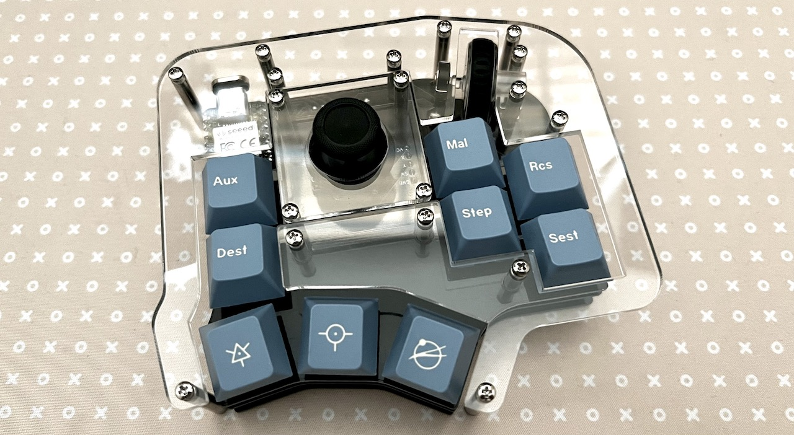

# Kombucha ジョイスティック アクリル積層ケース

## キット内容
|部品|数||
|-|-|-|
|トッププレート|1||
|ミドルプレート|10||
|ボトムプレート|1||
|スペーサー|6|[27mm](https://www.hirosugi-net.co.jp/shop/g/g2418/)|

## 組み立て
組み立てられた状態で届くのでネジを外して一度分解してください。

Kombuchaのアクリルプレートを外します。

保護フィルムを外したトッププレートを載せてねじ止めします。空いたネジ穴にスペーサーを取り付けます。

USB部分が開くように重ねます（隙間のあるミドルプレートの枚数が５枚のものと6枚のものがあります）。

ボトムプレートを取り付けます。

ゴム足を貼ったら完成です。

## ケースのデータ
### 元になるデータ
- 
kicadファイル、SVGファイル、DXFファイルが入っています。厚みは3mmです。各種サービスのルールに沿ってテンプレートに並べ替えたり線幅、色などを調節してください。  
Elecrowさんの少し薄い（2.8mm程度）のアクリル板を前提に設計しているので、国内サービスの精度の高い3mmのアクリルを使用した場合はスペーサーの長さ、使うミドルプレートの枚数等を現物に合わせていただく必要があるかもしれません。

### Elecrow向けファイル
- 
こちらのZipファイルで注文すると1ケース分揃います。
280.6x136.6mm、数量5枚、厚みは3mm、お好みの色で発注してください。

何かあった場合は英語でのやりとりになりますのでご注意ください。
