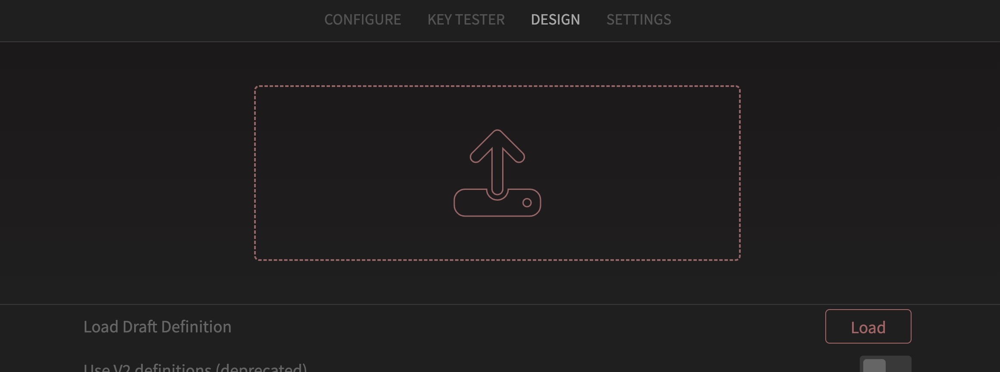
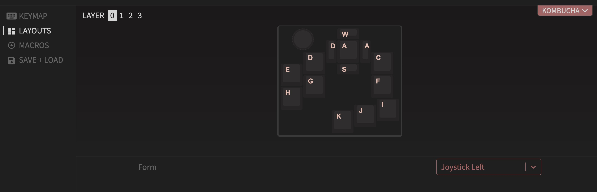
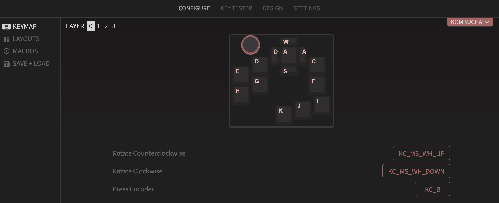

# Kombucha ジョイスティック
- [キット内容](#キット内容)
- [準備](#準備)
- [はんだ付け](#はんだ付け)
- [組み立て](#組み立て)
- [カスタマイズ](#カスタマイズ)
- [meishi Trackball Moduleを使う](#meishiTrackballModuleを使う)
- [その他](#その他)

## キット内容
  
||部品名|数| |
|-|-|-|-|
|1|メインボード|1||
|2|トッププレート|1||
|3|ボトムプレート|1||
|4|ジョイスティック基板|1||
|5|アクリルプレート|4||
|6|スペーサー（細）（短）|4|黄銅・3mm|
|7|スペーサー（細）（長）|4|黄銅・7mm|
|8|スペーサー（太）（短）|9|ステンレス・7mm|
|9|スペーサー（太）（長）|12|ステンレス・16mm|
|10|ねじ（短）|14|黒・4mm|
|11|ねじ（長）|12|銀|
|12|スプリング|2||
|13|5ピンヘッダ|2||
|14|7ピンヘッダ|3||
|15|5ピンソケット|1||
|16|7ピンソケット|1||
|17|スイッチソケット|9||
|18|ホイールエンコーダー|1|11mm|
|19|ホイール|1||
|20|ジョイスティック|1||
|21|キャップ|1||
|22|タクタイルスイッチ|1|7.5mm|
|23|タクタイルスイッチSMD|1|7mm|
|24|ダイオード|11||
|25|LED|9||
|26|ゴム足|4|

### キット以外に必要なもの
|部品名|数||
|-|-|-|
|XIAO RP2040|1|[TALP KEYBOARD](https://talpkeyboard.net/items/63534f58f5197322fceb6487)、[秋月電子通商](https://akizukidenshi.com/catalog/g/gM-17044/)|
|Cherry MX互換キースイッチ|1|[TALP KEYBOARD](https://talpkeyboard.net/?category_id=5f2d0726afaa9d40152b2cec)、[遊舎工房](https://shop.yushakobo.jp/search?sort_by=relevance&q=Cherry+MX&type=product&options%5Bprefix%5D=last&options%5Bunavailable_products%5D=last&filter.v.price.gte=&filter.v.price.lte=&filter.v.m.my_fields.switch_type=Clicky&filter.v.m.my_fields.switch_type=Linear&filter.v.m.my_fields.switch_type=Silent+Linear&filter.v.m.my_fields.switch_type=Silent+Tactile&filter.v.m.my_fields.switch_type=Tactile)|
|Cherry MX互換キーキャップ（1U）|1|各種キーボードショップ|
|Type-C USB ケーブル|1|各種キーボードショップ、100円均一など|

### オプション
|部品名||
|-|-|
|アクリル積層ケース|[取り付け方法](case.md)|
 
### 必要な工具
|工具名|
|-|
|はんだごて|
|はんだ|
|精密ドライバー|
|ニッパー|

## 準備

### 左右を決める
このキットは基板の表裏を変えることで左手用と右手用を作り分けることができます。 
 
どちらの面にどの部品を実装するかが基板に書いてあるので参考にしてください。  
※ビルドガイドの写真はすべて左手用です。右手の場合は適宜読み替えて制作してください。  

### XIAO RP2040にテストファームウェアを書き込む  
こちらのファイルをダウンロードしてください。
- [tarohayashi_kombucha_stick_default.uf2](https://github.com/Taro-Hayashi/Kombucha2/releases/download/0.19.0/tarohayashi_kombucha_stick_default.uf2)

基板上の右のBのボタンを押しながらPCに接続するとRPI-RP2というドライブとして認識されます。
 
ダウンロードしたファイルを書き込むとXIAO RP2040をキーボードとして使えるようになります。
 

<!-- 
### プレートを切り離す
メインボード、トッププレート、ボトムプレートを切り離します。そのまま折るだけでも割れますがカッターなどで切れ目を入れると入れる力が少なくて済みます。
 
ニッパーでバリを取り切断面を棒やすりで綺麗にします。

-->

## はんだ付け
### ボトムプレートのはんだ付け
左右を確認してボトムプレートにピンソケット2つをはんだ付けします。  
 
位置決めが難しい場合や使っているうちに剥がれた場合などはDIPタイプのピンソケットも使用することができます。  

ボトムプレートのピンソケットと同じ面の青丸の４箇所にスペーサー（細）（長）を、赤丸の9箇所にスペーサー（太）（短）をねじ（短）で止めます。

反対の面にはゴム足を貼ります。

### ジョイスティック基板のはんだ付け
ジョイスティック基板にジョイスティックをはんだ付けします。  

ジョイスティックが中央に戻らないことがありますが、アクリルプレートを取り付ける前の正常な動作です。

ボトムプレートのピンソケットに5ピンヘッダを立てます。短い方を差しました。  

ジョイスティック基板をスペーサー（細）（長）の上にのせ、スペーサー（太）（長）でボトムプレートに固定します。  

飛び出たピンヘッダをニッパーで切りはんだ付けしましょう（ギリギリまで切りすぎるとうまくはんだ付けできないことがあります）。  

ジョイスティックにキャップを取り付けます。

### メインボードのはんだ付け
LEDをはんだ付けします。欠けている方向と白い線が合うように置きます。  

XIAO RP2040をはんだ付けします。

USBケーブルを接続してLEDが発光することを確かめてください。光らない場合は向きが間違っていたりどこかでショートしていたりはんだ付けが足りない可能性があります。

USBケーブルを抜いてください。はんだ付けの作業は通電していない状態で行います。この後段階ごとに動作をチェックするようビルドガイドでは書いていますが、慣れている場合は読み飛ばして最後にまとめてチェックしても構いません。

ダイオードを折り曲げて差し込み、固定するためにさらに曲げます。表裏を指定してありますがどちら側でも構いません。

はんだ付けをしたら足をニッパーで切ります。

スイッチソケットをはんだ付けします。裏表に注意してください。

USBケーブルを接続してスイッチソケットの両端をピンセット等で短絡したり、スイッチソケットにスイッチを差し込んで押したりしてキーが機能することを確認してください。

USBケーブルを抜いて、メインボードにホイールエンコーダーとタクタイルスイッチをはんだ付けします。表裏に注意してください。

USBケーブルを接続してタクタイルスイッチを押して動作を確認してください。また、一旦ホイールを差し込んで回してみて動作を確認してください。

動作を確認できたらホイールを外し、ボトムプレートに7ピンヘッダを差し込みます。

ボトムプレートにメインボードを載せ、スペーサー（太）（長）でボトムプレートに固定します。
トッププレートで隠れる青丸の一箇所だけはねじ（短）で止めます。

飛び出たピンヘッダをニッパーで切ってはんだ付けしましょう。
テストファームウェアではジョイスティックは押し込みボタンのみ動作します。

トッププレートの4隅にスイッチを差し込みます。差し込みが硬い場合はここですべてのスイッチを固定してしまう方がいいかもしれません（スイッチの種類によって変わります）。

スペーサーを通してメインボードに乗せ、キースイッチがスイッチソケットに入るように押し込みます。

キースイッチのピンが曲がらないように気をつけてください。

全てのスイッチを差し込み、ホイールをホイールエンコーダーに差し込みます。あらためて動作を確認しておきましょう。

アクリルプレートから保護フィルムを剥がして、ねじ（長）で止めます。

キーキャップをつけて完成です。

LEDを消したい時は親指クラスタの奥のキーを押しながらジョイスティックを押し込んでください。

## カスタマイズ

こちらのファームウェアをダウンロードして書き換えます。
テストファームウェアを書き込んでからはXIAO RP2040に一番近いキーを押しながらUSBケーブルを繋ぐことでRPI-RP2のドライブを出すことが出来ます。
- [tarohayashi_kombucha_stick_stick.uf2](https://github.com/Taro-Hayashi/Kombucha2/releases/download/0.19.0/tarohayashi_kombucha_stick_default.uf2)

標準ではジョイスティックを傾けると方向に合わせてW、A、S、Dのキーが入力されるようになっています。これらを含めた全てのキーはVIAというWebサイト（もしくはアプリケーション）で好きなものに変更することができます。
こちらのJSONファイルをダウンロードしてください。
-[kombucha.json]|(https://github.com/Taro-Hayashi/Kombucha2/releases/download/0.19.0/kombucha.json)

Google Chrome（Microsoft Edge）を利用して下記webサイトにアクセスするか、VIAのアプリケーションをダウンロードして起動してください。
- [Web版VIA（Google Chromeでアクセスしてください）](https://usevia.app/#/design)
- [アプリ版VIA](https://github.com/the-via/releases/releases)

DESIGNタブのLoadでダウンロードしたJSONファイルを読み込ませるとキーの変更が出来るようになります。  
  
CONFIGUREタブのAuthorize device+からKombuchaを追加してください。

### 左右の変更
LAYOUTSから見た目の左右を変更することができます。
  

### ホイールの割り当てキー
キーマップ変更画面で上部の丸をクリックするとホイールを回転させた時と押し込んだ時に入力されるキーを変更することができます。
  

### マクロの設定

### その他の利用方法
ジョイスティックでマウスカーソルを動かすことも可能で、その場合はこちらのファイルをダウンロードしてファームウェアを書き換えてください。 
- [tarohayashi_kombucha_stick_cursor.uf2](https://github.com/Taro-Hayashi/Kombucha2/releases/download/0.19.0/tarohayashi_kombucha_stick_cursor.uf2)

こちらのファームウェアを書き込むことでKombuchaをゲームパッドとして認識させることもできます。
- [tarohayashi_kombucha_stick_joypad.uf2](https://github.com/Taro-Hayashi/Kombucha2/releases/download/0.19.0/tarohayashi_kombucha_stick_joypad.uf2)

### テープを巻く
10mmのマスキングテープや革テープで全周をデコレーションすることができます。前面は15mmのテープを巻くこともできます。

## meishiTrackballModuleを使う
### はんだ付け
meishi Trackball Module互換基板キットを使う場合は袋の番号を確認しながら部品をはんだ付けします。使わない場合はmeishi Trackball Moduleを基板から切り離してください。  
ピンヘッダを立てねじを使って基板の位置を決めます。  
はんだ付けをしたらねじを一度はずしてレンズとボールケースを取り付けます。  
ファームウェアはこちらをお使いください。  
- [tarohayashi_kombucha_ball_via.uf2](https://github.com/Taro-Hayashi/Kombucha2/releases/download/0.19.0/tarohayashi_kombucha_ball_via.uf2)

## その他
ファームウェアのフォルダ(RP2040のアナログ対応のため現在はdevelopブランチでのみコンパイル可能です。）
- https://github.com/Taro-Hayashi/qmk_firmware/tree/tarohayashi/keyboards/tarohayashi/kombucha
  
- BOOTH: https://tarohayashi.booth.pm/items/3252673 
