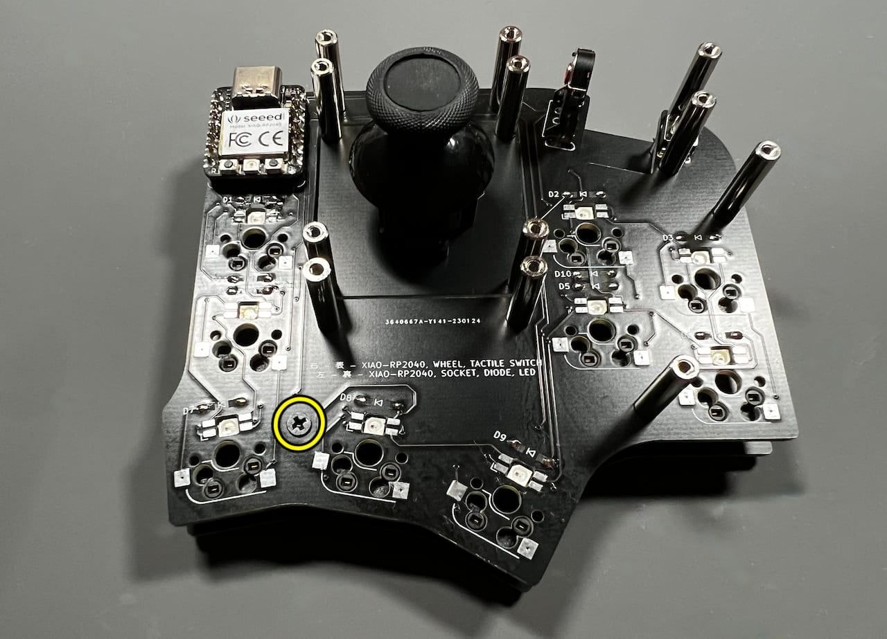
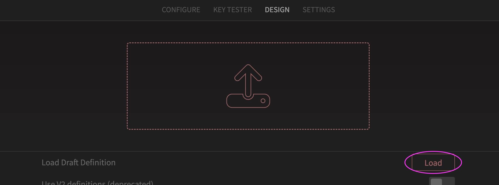
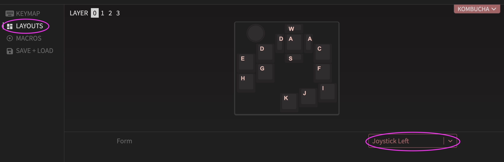
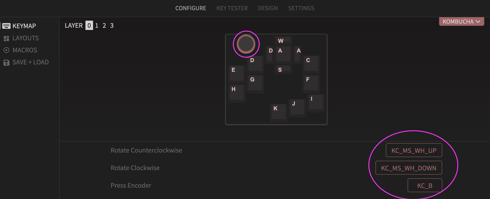
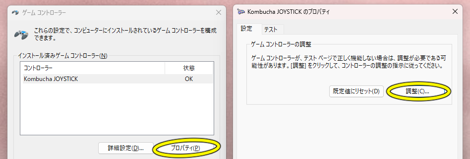
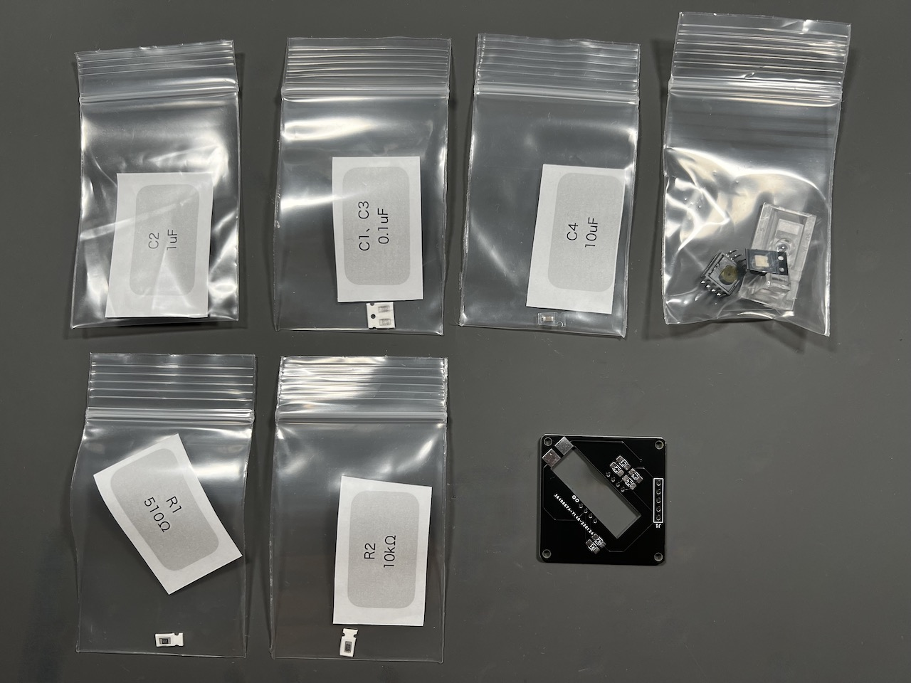
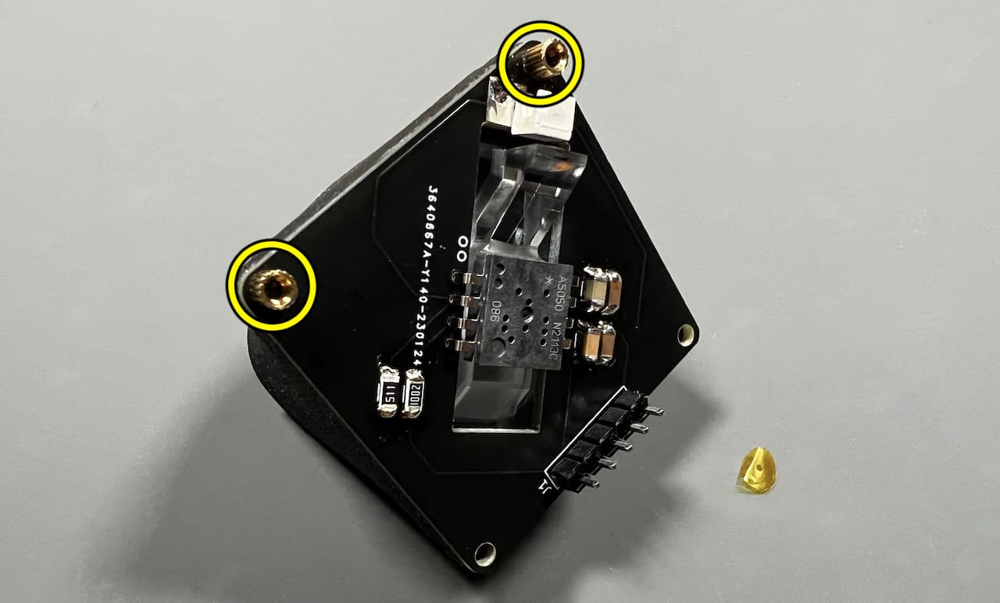
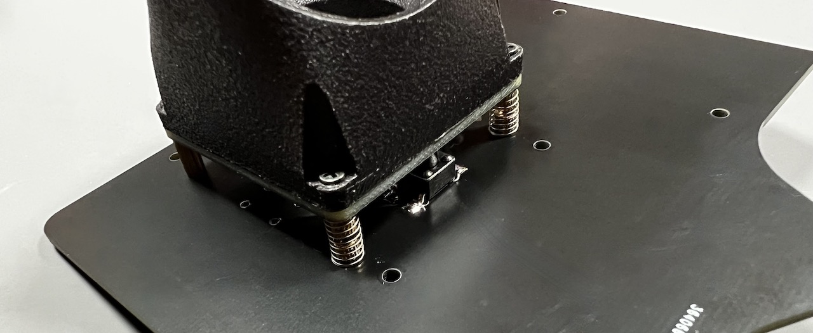

# Kombucha ジョイスティック 右手向けビルドガイド（[左手向け](README.md)）
- [キット内容](#キット内容)
- [準備](#準備)
- [はんだ付け](#はんだ付け)
- [組み立て](#組み立て)
- [カスタマイズ](#カスタマイズ)
- [meishi Trackball Moduleを使う](#meishiTrackballModuleを使う)
- [その他](#その他)

## キット内容
  
||部品名|数| |
|-|-|-|-|
|1|メインボード|1||
|2|トッププレート|1||
|3|ボトムプレート|1||
|4|ジョイスティック基板|1||
|5|アクリルプレート|4||
|6|スペーサー（細）（短）|4|黄銅・3mm|
|7|スペーサー（細）（長）|4|黄銅・7mm|
|8|スペーサー（太）（短）|9|ステンレス・7mm|
|9|スペーサー（太）（長）|12|ステンレス・16mm|
|10|ねじ（短）|14|黒・4mm|
|11|ねじ（長）|12|銀|
|12|スプリング|2||
|13|5ピンヘッダ|2||
|14|7ピンヘッダ|3||
|15|5ピンソケット|1||
|16|7ピンソケット|1||
|17|スイッチソケット|9||
|18|ホイールエンコーダー|1|11mm|
|19|ホイール|1||
|20|ジョイスティック|1||
|21|キャップ|1||
|22|タクタイルスイッチ|1|7.5mm|
|23|タクタイルスイッチSMD|1|7mm|
|24|ダイオード|11||
|25|LED|9||
|26|ゴム足|4|

### キット以外に必要なもの
|部品名|数||
|-|-|-|
|XIAO RP2040|1|[TALP KEYBOARD](https://talpkeyboard.net/items/63534f58f5197322fceb6487)、[秋月電子通商](https://akizukidenshi.com/catalog/g/gM-17044/)|
|Cherry MX互換キースイッチ|1|[TALP KEYBOARD](https://talpkeyboard.net/?category_id=5f2d0726afaa9d40152b2cec)、[遊舎工房](https://shop.yushakobo.jp/search?sort_by=relevance&q=Cherry+MX&type=product&options%5Bprefix%5D=last&options%5Bunavailable_products%5D=last&filter.v.price.gte=&filter.v.price.lte=&filter.v.m.my_fields.switch_type=Clicky&filter.v.m.my_fields.switch_type=Linear&filter.v.m.my_fields.switch_type=Silent+Linear&filter.v.m.my_fields.switch_type=Silent+Tactile&filter.v.m.my_fields.switch_type=Tactile)|
|Cherry MX互換キーキャップ（1U）|1|各種キーボードショップ|
|Type-C USB ケーブル|1|各種キーボードショップ、100円均一など|

### オプション
|部品名||
|-|-|
|アクリル積層ケース|[ケースデータと取り付け方法](CASE.md)|
 
### 必要な工具
|工具名|
|-|
|はんだごて|
|はんだ|
|精密ドライバー|
|ニッパー|

## 準備
<!-- 
### プレートを切り離す
メインボード、トッププレート、ボトムプレートを切り離します。そのまま折るだけでも割れますがカッターなどで切れ目を入れると入れる力が少なくて済みます。
 
ニッパーでバリを取り切断面を棒やすりで綺麗にします。

-->
### 左右を決める
このキットは基板の表裏を変えることで左手用と右手用を作り分けることができます。 
 
どちらの面にどの部品を実装するかが基板に書いてあるので参考にしてください。   

### XIAO RP2040にテストファームウェアを書き込む  
こちらのファイルをダウンロードしてください。
- [tarohayashi_kombucha_stick_default.uf2](https://github.com/Taro-Hayashi/Kombucha2/releases/download/0.19.12%2Fdevelop/tarohayashi_kombucha_stick_default.uf2)

基板上の右のBのボタンを押しながらPCに接続するとRPI-RP2というドライブとして認識されます。
 
ダウンロードしたファイルを書き込むとXIAO RP2040をキーボードとして使えるようになります。

## はんだ付け
### ボトムプレートのはんだ付け
左右を確認してボトムプレートにピンソケット2つをはんだ付けします。  
 
位置決めが難しい場合や使っているうちに剥がれた場合などはDIPタイプのピンソケットも使用することができます。  

ボトムプレートのピンソケットと同じ面にスペーサー（太）（短）をねじ（短）で止めます。黄丸の４箇所にはスペーサー（細）（長）を使います。
 
反対の面にはゴム足を貼ります。
 

### ジョイスティック基板のはんだ付け
ジョイスティック基板にジョイスティックをはんだ付けします。  
 
ジョイスティックが中央に戻らないことがありますが、アクリルプレートを取り付ける前の正常な動作です。

ボトムプレートのピンソケットに5ピンヘッダを立てます。短い方を差しました。  
 

ジョイスティック基板をスペーサー（細）（長）の上にのせ、スペーサー（太）（長）でボトムプレートに固定します。  
 

飛び出たピンヘッダをニッパーで切りはんだ付けしましょう（ギリギリまで切りすぎるとうまくはんだ付けできないことがあります）。  
 
ジョイスティックにキャップを取り付けました。  

### メインボードのはんだ付け
LEDをはんだ付けします。欠けている方向と白い線が合うように置きます。
   

XIAO RP2040を7ピンヘッダーではんだ付けします。
 

USBケーブルを接続してLEDが発光することを確かめてください。光らない場合は向きが間違っていたりどこかでショートしていたりはんだ付けが足りない可能性があります。
  
  
USBケーブルを抜いてください。はんだ付けの作業は通電していない状態で行います。  
この後も部品を取り付けるごとにその部品の動作を確認するとトラブルの原因を突き止めやすいです。  
    
ダイオードを折り曲げて差し込み、固定するためにさらに曲げます。表裏を指定してありますがどちら側でも構いません。
 
ダイオードには向きがあるので、黒線と基板の矢印の向きを合わせてください。

はんだ付けをしたら足をニッパーで切ります。
 

スイッチソケットをはんだ付けします。裏表に注意してください。
 

メインボードにホイールエンコーダーとタクタイルスイッチ（足が下に伸びている方）をはんだ付けします。表裏に注意してください。
 

ボトムプレートに7ピンヘッダを差し込みます。
 

ボトムプレートにメインボードを載せ、スペーサー（太）（長）でボトムプレートに固定します。トッププレートで隠れる黄丸の一箇所だけはねじ（短）で止めます。
 
飛び出たピンヘッダをニッパーで切ってはんだ付けしましょう。テストファームウェアではジョイスティックは動作しません。
 
トッププレートの4隅にスイッチを差し込みます。差し込みが硬い場合はここですべてのスイッチを固定してしまう方がいいかもしれません（スイッチの種類によって変わります）。
 

スペーサーを通してメインボードに乗せ、キースイッチがスイッチソケットに入るように押し込みます。
 
キースイッチのピンが曲がらないように気をつけてください。

全てのスイッチを差し込み、ホイールをホイールエンコーダーに差し込みます。
 

アクリルプレートから保護フィルムを剥がして、ねじ（長）で止めます。
 

キーキャップをつけて完成です。
 
こちらのファームウェアを書き込んでください。XIAO RP2040のBのスイッチを押す代わりに、XIAO RP2040に一番近いキーを押しながらUSBケーブルを繋ぐことでRPI-RP2のドライブを出すことが出来ます。
- [tarohayashi_kombucha_stick_stick.uf2](https://github.com/Taro-Hayashi/Kombucha2/releases/download/0.19.12%2Fdevelop/tarohayashi_kombucha_stick_stick.uf2)
  
LEDを消したい時は親指クラスタ（最下段）の奥のキーを押しながらジョイスティックを押し込んでください。

## カスタマイズ
ジョイスティックを含めた全てのキーはVIAというWebサイト（もしくはアプリケーション）で好きなものに変更することができます。  
こちらのJSONファイルをダウンロードしてください。 
- [kombucha.json](https://github.com/Taro-Hayashi/Kombucha2/releases/download/0.19.12%2Fdevelop/kombucha.json)

Google Chrome（Microsoft Edge）を利用して下記webサイトにアクセスするか、VIAのアプリケーションをダウンロードして起動してください。
- [Web版VIA（Google Chromeでアクセスしてください）](https://usevia.app/#/design)
- [アプリ版VIA](https://github.com/the-via/releases/releases)

DESIGNタブのLoadでダウンロードしたJSONファイルを読み込ませるとキーの変更が出来るようになります（アプリ版ではまずShow Design tabをオンにしてください）。  
  
CONFIGUREタブのAuthorize device+からKombuchaを追加してください。

### 左右の変更
LAYOUTSから見た目の左右を変更することができます。
  

### ホイールの割り当てキー
キーマップ変更画面で上部の丸をクリックするとホイールを回転させた時と押し込んだ時に入力されるキーを変更することができます。
  

### その他の利用方法
ジョイスティックでマウスカーソルを動かすことも可能で、その場合はこちらのファイルをダウンロードしてファームウェアを書き換えてください。 
- 左手用 [tarohayashi_kombucha_stick_cursor_left.uf2](https://github.com/Taro-Hayashi/Kombucha2/releases/download/0.19.12%2Fdevelop/tarohayashi_kombucha_stick_cursor_left.uf2)
- 右手用 [tarohayashi_kombucha_stick_cursor_right.uf2](https://github.com/Taro-Hayashi/Kombucha2/releases/download/0.19.12%2Fdevelop/tarohayashi_kombucha_stick_cursor_right.uf2)

こちらのファームウェアを書き込むことでKombuchaをゲームパッドとして認識させることもできます。
- 左手用 [tarohayashi_kombucha_stick_joypad_left.uf2](https://github.com/Taro-Hayashi/Kombucha2/releases/download/0.19.12%2Fdevelop/tarohayashi_kombucha_stick_joypad_left.uf2)
- 右手用 [tarohayashi_kombucha_stick_joypad_right.uf2](https://github.com/Taro-Hayashi/Kombucha2/releases/download/0.19.12%2Fdevelop/tarohayashi_kombucha_stick_joypad_right.uf2)

#### ジョイスティックの補正
スタートメニューにJOY.CPLと打ち込むとスティックの補正ができます。
  
プロパティから調整を選びウィザードに従ってください。
  
それでも上手く動かない場合はゲームパッドとしてではなく通常のファームウェアにカーソルキーやWASDを割り当ててお使いください。

## meishiTrackballModuleを使う
### はんだ付け
一度分解し、ボトムプレートにタクタイルスイッチSMDをはんだ付けします。
  
ピンヘッダーが有る側の2箇所はスペーサー（細）（長）、無い側の2箇所はスペーサー（細）（短）をねじ止めします。
 
meishi Trackball Module互換基板キットを使う場合は袋の番号を確認しながら部品をはんだ付けします。使わない場合はmeishi Trackball Moduleを基板から切り離してください。
  
抵抗やコンデンサーは小袋から出すと見分けが付かなくなるので1種類ずつはんだ付けしてください。
  
LEDをはんだ付けします。
  
センサーをはんだ付けします。
  
ジョイスティックの時と同様にピンヘッダを立てモジュール付属のねじを使って基板の位置を決めたらはんだ付けします。
  
はんだ付けをしたらねじを一度はずしてモジュール基板を取り外し、センサーの保護フィルムをはがしてレンズとボールケースを取り付けます。  
  
ピンヘッダーのない側にスペーサー（細）（短）をねじで止めます。  
  
スペーサーの上にスプリングを立てます。

ねじでスペーサー（細）（長）側も止めるとボールのクリックができるようになります。

組み立て直したら完成です。

ファームウェアはこちらをお使いください。  
- [tarohayashi_kombucha_ball_via.uf2](https://github.com/Taro-Hayashi/Kombucha2/releases/download/0.19.12%2Fdevelop/tarohayashi_kombucha_ball_via.uf2)

### トラックボールの調整
親指クラスタの真ん中のキーを押しながらボールの左右のキーを押すとセンサーの感度（CPI）を増減できます。その下のキーを押すとマウスカーソルの上下左右の十字方向と10°の微調整が可能です。

## その他
### ファームウェアのフォルダ
- https://github.com/Taro-Hayashi/Kombucha2/tree/main/qmk_firmware/keyboards/tarohayashi/kombucha

### ファームウェアまとめ
- テスト用 [tarohayashi_kombucha_stick_default.uf2](https://github.com/Taro-Hayashi/Kombucha2/releases/download/0.19.12%2Fdevelop/tarohayashi_kombucha_stick_default.uf2)
- スティックにキー割り当て [tarohayashi_kombucha_stick_stick.uf2](https://github.com/Taro-Hayashi/Kombucha2/releases/download/0.19.12%2Fdevelop/tarohayashi_kombucha_stick_stick.uf2)
- マウスカーソル左手用 [tarohayashi_kombucha_stick_cursor_left.uf2](https://github.com/Taro-Hayashi/Kombucha2/releases/download/0.19.12%2Fdevelop/tarohayashi_kombucha_stick_cursor_left.uf2)
- マウスカーソル右手用 [tarohayashi_kombucha_stick_cursor_right.uf2](https://github.com/Taro-Hayashi/Kombucha2/releases/download/0.19.12%2Fdevelop/tarohayashi_kombucha_stick_cursor_right.uf2)
- ジョイパッド左手用 [tarohayashi_kombucha_stick_joypad_left.uf2](https://github.com/Taro-Hayashi/Kombucha2/releases/download/0.19.12%2Fdevelop/tarohayashi_kombucha_stick_joypad_left.uf2)
- ジョイパッド右手用 [tarohayashi_kombucha_stick_joypad_right.uf2](https://github.com/Taro-Hayashi/Kombucha2/releases/download/0.19.12%2Fdevelop/tarohayashi_kombucha_stick_joypad_right.uf2)
- トラックボール [tarohayashi_kombucha_ball_via.uf2](https://github.com/Taro-Hayashi/Kombucha2/releases/download/0.19.12%2Fdevelop/tarohayashi_kombucha_ball_via.uf2)

### アクリルプレートのデータ
DXF、SVG、kicadファイルが入っています。
- [kombucha_acrylic_case_elecrow.zip](https://github.com/Taro-Hayashi/Kombucha2/releases/download/0.19.12%2Fdevelop/kombucha_acrylic_case_elecrow.zip)

### 謝辞
aki27さんのコードを参考にトラックボール用のファームウェアを書きました。
- URL　https://github.com/aki27kbd/qmk_firmware
- ライセンス https://github.com/aki27kbd/qmk_firmware/blob/master/LICENSE

### 販売サイト  
- BOOTH: https://tarohayashi.booth.pm/items/3252673 

