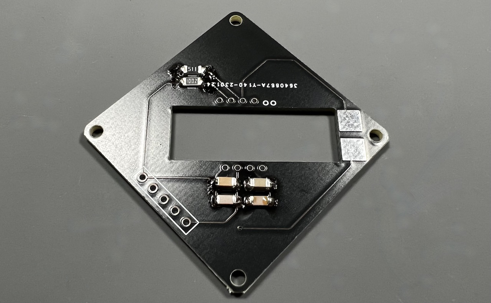
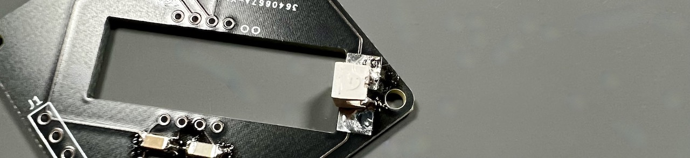

# meishi Trackball Module互換基板キットの組み立て方
※販売終了のため別ページに分けました。いずれリンクを外しますので、見当たらない場合はリポジトリのファイル一覧から閲覧してください。

袋の番号を確認しながら部品をはんだ付けします。
  
抵抗やコンデンサーは小袋から出すと見分けが付かなくなるので1種類ずつはんだ付けしてください。
  
LEDをはんだ付けします。
  
センサーをはんだ付けします。

ブラウザの機能で戻ってください。
